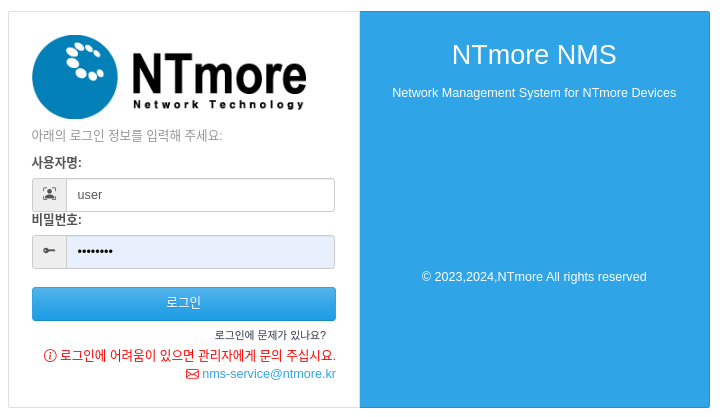

FAQ
==========================

.. contents::
   :local:

접속 문제
------------------------------------

사이트에 접속을 할 수 없습니다.
~~~~~~~~~~~~~~~~~~~~~~~~~~~~~~~~~~~~~~~~~~
본 서비스는 사이트 정책에 따라 사용자(업체) 1개의 IP만 접속이 가능합니다. 만약 IP가 변경되었을시에는 nms-service@ntmore.kr 로 메일을 주십시요.

1개 이상의 IP혹은 외부 접속을 할 수 없습니다.
~~~~~~~~~~~~~~~~~~~~~~~~~~~~~~~~~~~~~~~~~~~~~~~~~~~~~~~
본 서비스는 사이트 방화벽 정책에 따라 접속IP를 1개로 고정 합니다. **서비스 접속 포트를 완전 개방하는것은 불가능** 합니다. 

.. note::

   사용자가 내부에서 접속IP에 VPN과 유사한 서비스를 구축해서 사용을 권장합니다.

로그인 문제
------------------------------------

.. Old reference
.. _My project isn't building correctly:

로그인을 할 수 없습니다.
~~~~~~~~~~~~~~~~~~~~~~~~~~~~~~~~~~~~~~~~~~

아이디와 패스워드를 다시한번 확인해 주십시요.

패스워드가 기억나지 않습니다.
~~~~~~~~~~~~~~~~~~~~~~~~~~~~~~~~~~~~~~~~~~

nms-service@ntmore.kr 로 아래와 같은 정보를 메일로 보내주시기 바랍니다. 

:아이디: 사용중 아이디 정보
:패스워드:  변경할 패스워드 정보
:업체명:  현재 사용중인 업체명

사이트 문제
------------------------------------ 

표시되는 그래프가 올바르지 않은것 같습니다.
~~~~~~~~~~~~~~~~~~~~~~~~~~~~~~~~~~~~~~~~~~~~~~

그래프는 **1시간** 주기마다 캐싱으로 갱신되고 있습니다. 만약 올바르게 보여지지 않는다면, 약 2시간후에 다시 접속을 해보시면 됩니다.

.. note::

   **접속 이력 현황** 그래프는 현재 접속 기준으로 1일 지나야 표시가 됩니다.

목록에 표시되지 않는 디바이스가 있습니다.
~~~~~~~~~~~~~~~~~~~~~~~~~~~~~~~~~~~~~~~~~~
전산상에 등록이 확인 되어 있지 확인이 필요합니다.

nms-service@ntmore.kr 로 아래와 같은 정보를 메일로 보내주시기 바랍니다. 

:디바이스 시리얼 정보: *예) 000093*
:디바이스 모델 정보: *예) NTLM9607-S4*
:디바이스의 IMEI 정보: *예) 3579xxxxxxxxxx*
:사용자 업체명: *예) 엔티모아*

혹은 후면의 사진을 찍어 보내주셔도 됩니다.

기타 문제
------------------------------------

기타 문의는 nms-service@ntmore.kr 로 아래와 같은 정보를 메일로 보내주시기 바랍니다. 