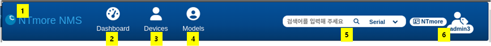

기본 기능
=============

사용자 로그인후에는 다음과 같은 메뉴가 표시 됩니다. 로그인후에는 **대쉬보드** 메뉴로 기본으로 이동합니다.

.. note:: 약관동의를 하지 않으면 메뉴가 다르게 보일 수 있습니다.

메뉴에 대한 설명은 아래와 같습니다.

1. **인덱스 메뉴** : 로고를 누르면 현재 화면으로 돌아갑니다.
2. **Dashboard** : 대시보드 메뉴로 들어갑니다.
3. **Devices** : 디바이스 메뉴로 들어갑니다.
4. **Models** : 모델 메뉴로 들어갑니다.
5. **검색** : 빠르게 검색할수 있는 검색창입니다. 추가 메뉴를 선택하여 **모델명,IMEI,Number(전화번호)** 를 바로 검색할 수 있습니다.
6. **유저정보** : 개인 정보를 표시하는 메뉴입니다. 업체와 사용자에 관한 내용이 표시됩니다.