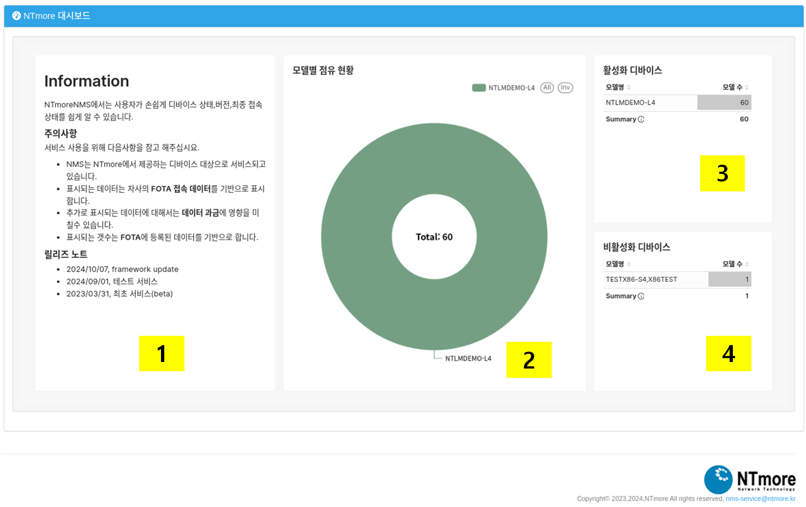

DashBoard(대쉬보드)
===================

대쉬보드는 사용자의 모델에 대한 통계를 제공합니다. 현재 활성화 되어있는 디바이스와, 활성화 되지 않은 디바이스를
간단히 보여주고 있습니다.

1. **Information** : NMS의 일반적인 공지사항을 표시합니다. NMS 사용시 주의사항이나, 릴리즈 노트가 표시됩니다.
2. **모델별 점유 현황** : 판매된 모델 현황을 표시합니다.
3. **활성화 디바이스** : 서버에 등록되어 수집이 되고 있는 디바이스의 갯수를 표시합니다.
4. **비활성화 디바이스** : 서버에 등록되어 있지만 수집이 되지 않고 통계에 제외된 디바이스의 갯수를 표시합니다.
