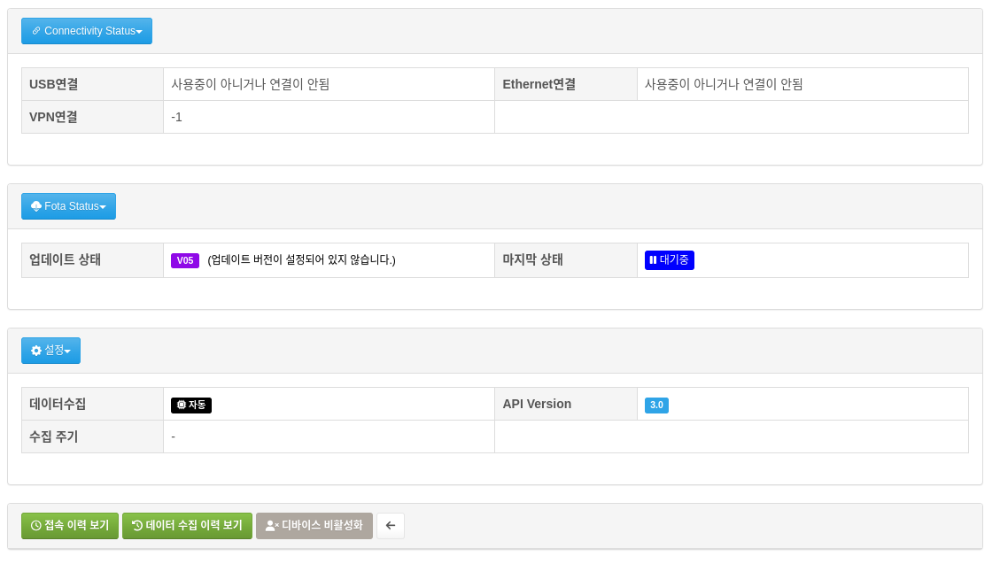
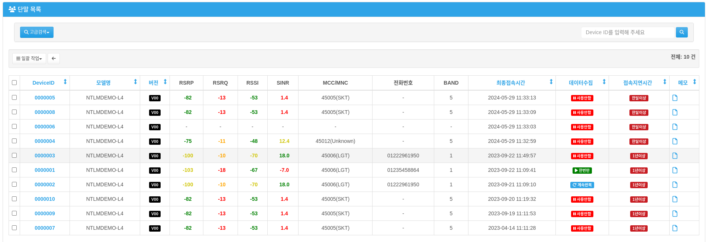

Devices(디바이스조회)
=====================

디바이스조회 메뉴는 사용자의 디바이스의 각각에 대한 자세한 정보를 제공합니다. 

------------------------------

모델별 단말 현황
------------------------------------
단말 목록 메뉴는 사용자가 구매한 모델을 분류하여 현황을 보여줍니다.
여기서 보여지는 디바이스의 수는 서버에 등록된 활성화 된 디바이스의 갯수이며, 만약 표시된 내용과 다를시에는 관리자에게
디바이스의 등록을 요청하거나 **단말 목록(비활성화)** 메뉴에서 활성화를 할수 있습니다.

사이드바에서는 사용자가 구매한 모델들이 표시되며, 숫자로 활성화 된 디바이스의 갯수가 표시됩니다.

.. image:: ./images/devices-03.png
    :width: 50%

오른쪽 상단에는 각 모델별 디바이스의 상황을 통계로 표시해주고 있습니다.

#. 연결이 지연된 디바이스 수 를 보여주는 그래프 입니다. 
#. FOTA 버전 정보를 보여주는 그래프 입니다. Vendor 버전을 의미합니다.
#. 해당 모델에 대한 전체 리스트를 보여줍니다. 세세한 검색이 필요한 경우 사용합니다.
#. 해당 조건(지연시간)을 우선 기반으로 검색하여 자세한 리스트를 보여줍니다.
#. 해당 조건(FOTA 버전)을 우선 기반으로 검색하여 자세한 리스트를 보여줍니다.
#. 해당 모델에 대한 리스트를 CSV 파일로 내보내기를 합니다. 

.. note:: 표시되는 그래프는 서버에서 캐싱(caching)된 그래프이며, 반영에 지연이 있을 수 있습니다.

오른쪽 하단에는 각 모델에 해당되는 디바이스의 정보를 **최종접속시간** 순으로 표시하고 있습니다.

#. **디바이스** : 모델에 해당되는 디바이스가 표시됩니다. 클릭시에 자세한 내용이 표시되는 **단말 목록** 으로 이동됩니다.
#. **버전** : 디바이스의 현재 버전입니다. 단말기의 버전이라고 칭하는건 일반적으로 이 내용을 의미 합니다..
#. **RSRP/RSRQ/RSSI/SINR** : 디바이스에 대한 망 정보 상태입니다. *(API 2.0 이하 버전일 경우에는 데이터수집 설정에 따라 표시 됩니다.)*
#. **BAND** : 디바이스가 접속된 망의 BAND 정보 입니다. *(API 2.0 이하 버전일 경우에는 데이터수집 설정에 따라 표시 됩니다.)*
#. **전화번호** : 디바이스의 전화번호 입니다. *(API 2.0 이하 버전일 경우에는 데이터수집 설정에 따라 표시 됩니다.)* 
#. **단말버전** : 인증된 디바이스의 단말 버전입니다.
#. **최종접속시간** : 서비스에 접속된 최종 접속 시간입니다.
#. **데이터수집** : 데이터 수집 방법입니다. 클릭시에 ``사용안함`` --> ``한번만`` --> ``계속반복`` 으로 변경됩니다. *(API3.0 이상 버전에는 기본값인 자동으로 수집합니다.)* 
#. **접속지연시간** : 오늘을 기준으로 최종접속시간과의 차이를 보여줍니다.
#. **메모** : 클릭시 간단한 메모를 할 수 있습니다. 또한 서비스에 반복된 접속등의 이상증상이 확인시에 관련정보가 표시 됩니다. *(예시: 짦은시간에 반복적인 접속이 확인될경우 주의 표시)*

------------------------------

단말 목록 
''''''''''''''''''''''''''''

디바이스 번호를 선택하면 아래의 화면을 볼 수 있습니다.

------------------------------

- **단말 정보**

.. image:: ./images/devices-07.png
    :width: 100%

내용은 다음과 같습니다.

  * **DeviceID** :  디바이스의 Serial Number가 표시 됩니다.
  * **모델명** : 디바이스의 모델명입니다.
  * **전화번호** : 디바이스의 전화 번호 입니다. *(API 2.0 이하 버전일 경우에는 데이터수집 설정에 따라 표시 됩니다.)* 
  * **IMEI** : 디바이스의 IMEI 일련번호 입니다. *(API 2.0 이하 버전일 경우에는 데이터수집 설정에 따라 표시 됩니다.)* 
  * **접속시간** : 디바이스가 부팅후 서버에 접속되기 전까지의 시간입니다. 만약 디바이스가 재시작(reboot)을 하는 경우 초기화 됩니다. 디바이스 재시작 유무를 간단히 확인 가능합니다.
  * **단말버전** : 인증된 디바이스의 단말 버전입니다. *(API 2.0 이하 버전일 경우에는 데이터수집 설정에 따라 표시 됩니다.)* 
  * **버전** : 디바이스의 현재 버전입니다. 단말기의 버전이라고 칭하는건 일반적으로 이 내용을 의미 합니다.
  * **최종접속시간** : 서비스에 접속된 최종 접속 시간입니다.
  * **데이터갱신시간** : 데이터 수집시 실행한 시간 입니다. *(API 2.0 이하 버전일 경우에는 데이터수집 설정에 따라 표시 됩니다.)* 
  * **접속지연시간** : 오늘을 기준으로 최종접속시간과의 차이를 보여줍니다.
  * **특이사항메모** : 사용자가 메모한 내용을 보여줍니다.

------------------------------

- **네트워크 정보**

내용은 다음과 같습니다.

  * **MCC/MNC** : 디바이스가 망에 연결된 통신사의 MCC/MNC를 보여줍니다. *(API 2.0 이하 버전일 경우에는 데이터수집 설정에 따라 표시 됩니다.)*
  * **BAND** : 디바이스가 망에 연결된 통신사의 BAND 정보 입니다. *(API 2.0 이하 버전일 경우에는 데이터수집 설정에 따라 표시 됩니다.)*
  * **CellId** : 디바이스가 망에 연결된 통신사의 CellID 정보 입니다. *(API 2.0 이하 버전일 경우에는 데이터수집 설정에 따라 표시 됩니다.)* 
  * **RSRP/RSRQ/RSSI/SINR** : 디바이스에 대한 망 상태 정보 입니다. *(API 2.0 이하 버전일 경우에는 데이터수집 설정에 따라 표시 됩니다.)*
  * **APN** : 서비스에 접속된 APN의 정보 입니다. *(API 2.0 이하 버전일 경우에는 데이터수집 설정에 따라 표시 됩니다.)*
  * **IP ADDRESS** : 서비스에 접속된 IP 정보 입니다. *(API 2.0 이하 버전일 경우에는 데이터수집 설정에 따라 표시 됩니다.)*

------------------------------

- **Connectivity Status/Fota Status/설정**

내용은 다음과 같습니다.

  * **USB연결** : 디바이스에 USB가 연결되어 있는지 표시합니다. *(실험적 기능) (API 2.0 이하 버전일 경우에는 데이터수집 설정에 따라 표시 됩니다.)*
  * **Ethernet연결** : 디바이스가 Ethernet에 연결 되어 있는지 표시 합니다. *(실험적 기능) (API 2.0 이하 버전일 경우에는 데이터수집 설정에 따라 표시 됩니다.)*
  * **VPN연결** : 디바이스가 VPN에 연결되어 사용중인지 표시 합니다. *(실험적 기능) (API 2.0 이하 버전일 경우에는 데이터수집 설정에 따라 표시 됩니다.)* 
  
  
  * **업데이트 상태** : FOTA서비스의 진행 상태를 보여 줍니다. 업데이트가 예약되어 있다면 ``V01`` --> ``V02`` **(업데이트가 대기중입니다.)** 와 같은 문구가 표시됩니다.
  * **마지막 상태** : FOTA서비스의 마지막 상태를 보여 줍니다.
  * **데이터수집** : 데이터 수집 방법입니다. 클릭시에 :guilabel:`사용안함` --> :guilabel:`한번만` --> :guilabel:`계속반복` 으로 변경됩니다. *(API3.0 이상 버전에는 기본값인 자동으로 수집합니다.)* 
  
  
  * **API Version** : 현재 디바이스가 지원하는 API 버전 입니다.
  * **수집 주기** :  디바이스의 수집 주기를 표시합니다. *(실험적 기능)*

  

------------------------------

3가지 :guilabel:`버튼` 은 다음과 같은 기능을 합니다.

:guilabel:`접속 이력 보기` : 현재 디바이스가 지원하는 API 버전 입니다.

:guilabel:`데이터 수집 이력 보기` : 디바이스의 수집 주기를 표시합니다. *(실험적 기능)* 

:guilabel:`디바이스 비활성화` : 디바이스의 수집 주기를 표시합니다. *(실험적 기능)*

------------------------------

- **접속이력 현황**

접속 이력 현황을 그래프로 보여줍니다. 왼쪽 그래프는 점 분포로 접속 패턴 주기를 유추 할수 있으며, 오른쪽 그래프로는 날짜별 서버 접속 횟수를 알 수 있습니다.

------------------------------

단말 목록(전체)
------------------------------------
사용자가 보유한 활성화 되어 있는 모든 디바이스들이 전부 표시 됩니다. 
고급검색을 이용하여, 세세한 검색이 가능하며, 단말목록 보기보다 좀더 많은 정보를 보여 줍니다.

오른쪽 상단 입력창에 DeviceID를 입력하면 빠르게 디바이스를 검색할수 있으며, 왼쪽상단에는 고급 검색 기능이 있습니다.

단말 목록(비활성화)
------------------------------------
비활성화 되어 있는 디바이스 목록이 전부 표시 됩니다. 여기서 사용자 활성화를 할 수 있습니다. 비활성화 되어있는 디바이스는 통계에서 제외 됩니다.

