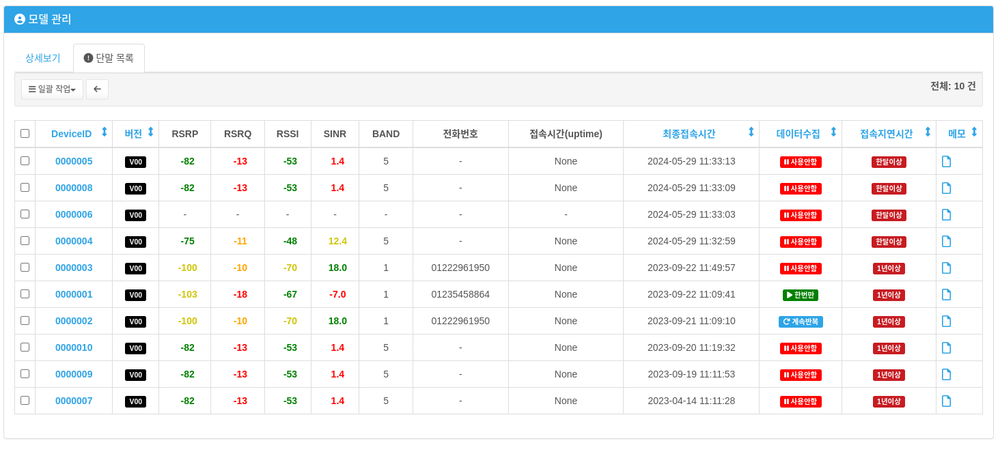

Models(모델조회)
=================

사용자가 소유하고 있는 모델에 대한 정보를 보여줍니다.

모델 관리
------------------------------------

* **통신사** : 인증받은 통신사가 표시 됩니다.
* **지원 band** : 지원되는 band가 표시 됩니다.
* **사용칩셋** : 사용하는 모뎀 Chipset이 표시 됩니다.
* **인터페이스** : 사용하는 모뎀의 인터페이스가 표시 됩니다.
* **최신 릴리즈 날짜** : 최신 바이너리 릴리즈 날짜가 표시 됩니다.
* **인증된 모뎀 버전** : 인증된 모뎀의 버전이 표시 됩니다.
* **버전(Vendor)** : FOTA에 사용되는 버전이 표시 됩니다. **버전** 을 이야기 하면 일반적으로 이 버전을 의미 합니다.
* **설명** : 설명 내용.

모델에 대한 상세 정보를 보여줍니다. 또한 타이틀의 모델명을 클릭하면 아래 **상세 보기** 와 **단말 목록** 을 탭으로 선택할 수 있습니다.

상세 보기
''''''''''''''''''''''''''''

단말 목록
''''''''''''''''''''''''''''

단말 목록에는 해당 모델을 기준으로 표시해 줍니다.
